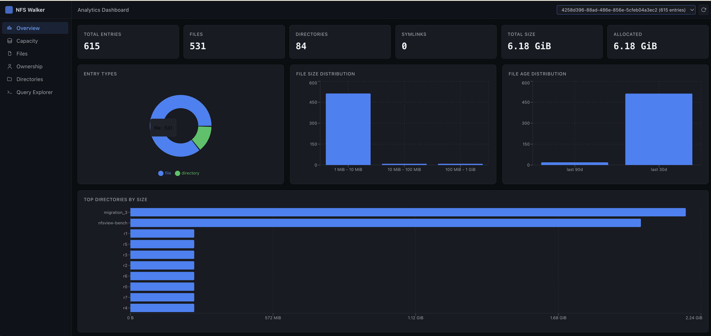
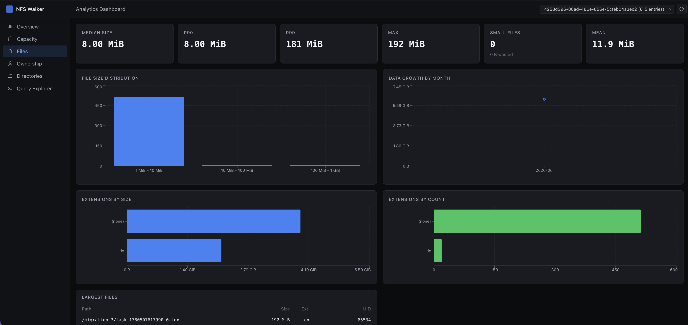
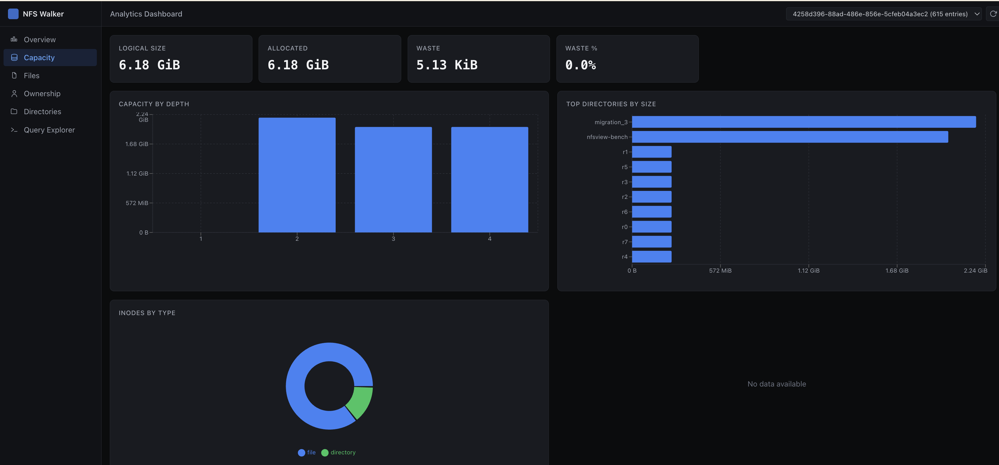
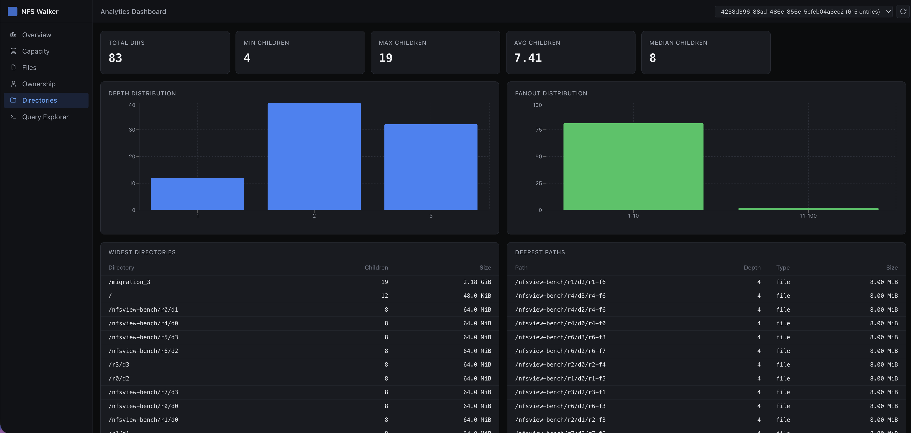
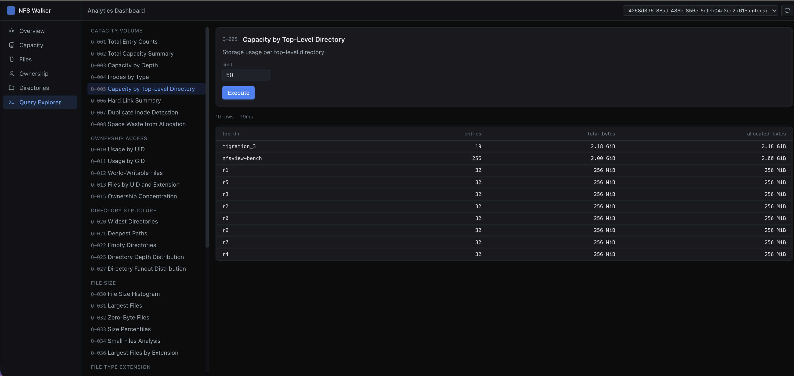

# nfs-walker

High-performance NFS filesystem scanner. Streams directly to sharded
Parquet at **690 K files/sec** on a single 128-core host (810 M-file
production bench against a VAST cluster — see [Performance](#performance)).

## Features

- **Direct NFS protocol** via libnfs — no kernel NFS client
- **READDIRPLUS pipelining** — names AND attributes in one RPC
- **Work-stealing parallelism** — every worker pulls from a shared deque
- **Sharded Parquet output** — N independent writer threads, ZSTD-compressed,
  layout matches what DuckDB / DataFusion / Polars expect out of the box
- **Per-scan progress logfile** — sidecar `<output>.log` records throughput,
  worker activity, per-shard write latency every 5 s

## Quick Start

```bash
# Scan an NFS export
nfs-walker nfs://server/export -o scan.parquet -w 230

# Show scan-overview stats
nfs-walker stats scan.parquet

# Query directly with DuckDB — no conversion step
duckdb -c "SELECT file_type, COUNT(*), SUM(size)/1e9 AS gb \
           FROM 'scan.parquet/scans/*/part-*.parquet' GROUP BY 1"
```

Output layout:
```
scan.parquet/
└── scans/
    └── <scan_id>/
        ├── part-r00-00000.parquet
        ├── part-r00-00001.parquet
        ├── part-r01-00000.parquet
        ...
        └── metadata.json
```

## Installation

### Download a prebuilt binary (no build required)

Grab the latest static binary from the
[Releases page](https://github.com/blakegolliher/nfs-walker/releases). It is a
fully static x86_64 Linux binary — musl libc, libnfs, zstd and zlib are all baked
in, so there is no glibc or shared-library dependency. It runs on any Linux distro.

```bash
# Replace v0.1.0 with the release you want
VER=v0.1.0
curl -LO https://github.com/blakegolliher/nfs-walker/releases/download/$VER/nfs-walker-$VER-x86_64-unknown-linux-musl
curl -LO https://github.com/blakegolliher/nfs-walker/releases/download/$VER/nfs-walker-$VER-x86_64-unknown-linux-musl.sha256

# Verify the checksum, then install
sha256sum -c nfs-walker-$VER-x86_64-unknown-linux-musl.sha256
install -m 0755 nfs-walker-$VER-x86_64-unknown-linux-musl /usr/local/bin/nfs-walker

# NFSv3 mountd needs a privileged source port — run scans with sudo
sudo nfs-walker --help
```

`ldd nfs-walker` should report `not a dynamic executable`, confirming it is
fully static.

### Build from source

```bash
# Static musl binary (any Linux)
make release

# Docker / Podman (Rocky 9 toolchain, glibc 2.34)
make docker-rocky
```

See [docs/BUILDING.md](docs/BUILDING.md) for native builds and dependencies.

## Usage

### Scanning

```bash
# Basic
nfs-walker nfs://server/export -o scan.parquet

# 230 workers (typical prod config, sits just under VAST's per-source-IP cap)
nfs-walker nfs://server/export -o scan.parquet -w 230 --pipeline-depth 16

# Directories only
nfs-walker nfs://server/export --dirs-only -o dirs.parquet

# With exclusions
nfs-walker nfs://server/data --exclude ".snapshot" --exclude ".zfs" -o scan.parquet

# Limit depth
nfs-walker nfs://server/export -d 3 -o shallow.parquet

# Bypass DNS round-robin (auth DNS returns a single A record per query)
nfs-walker nfs://server/export -o scan.parquet \
    --server-ips 172.200.202.1,172.200.202.2,172.200.202.3
```

### Tuning

```bash
nfs-walker nfs://server/export -o scan.parquet \
    --writer-shards 32 \
    --parquet-compression zstd3
```

| Flag                          | Default | What it controls |
|-------------------------------|---------|------------------|
| `--writer-shards`             | 32      | Parquet writer threads + path-keyspace shards |
| `--parquet-compression`       | zstd3   | Compression algo (`zstd1/3/6`, `snappy`, `lz4-raw`, `none`) |
| `-w, --workers`               | 2×CPU   | NFS worker threads |
| `--pipeline-depth`            | 0       | READDIRPLUS RPCs in flight per worker (recommend 8–16) |
| `--big-dir-split-after`       | 1000000 | Split a giant flat dir into continuations at this many entries |

Row-group size (256 K rows), part-file rotation (512 MiB), and writer
channel depth (64 batches) are fixed at the values the 810 M-file
production bench validated — they are internals, not tunables.

### Querying results

Output is plain Parquet — point any tool at it:

```bash
# DuckDB
duckdb -c "SELECT file_type, COUNT(*), SUM(size)/1e9 AS gb \
           FROM 'scan.parquet/scans/*/part-*.parquet' GROUP BY 1"

duckdb -c "SELECT path, size FROM 'scan.parquet/scans/*/part-*.parquet' \
           ORDER BY size DESC LIMIT 20"

# DataFusion / Polars / pandas read the same path; metadata.json lists
# every part file for the scan.
```

Built-in scan-overview (counts / total size / max depth):

```bash
nfs-walker stats scan.parquet
```

### Per-scan progress logfile

Every scan writes a sidecar logfile next to the output (`<output>.log`).
Snapshots fire every 5 s and capture: timestamp, elapsed, dirs/files/bytes,
throughput, active workers / total, per-shard write-batch latency
(avg + p99), shard channel queue depth, on-disk scan size.

```bash
nfs-walker nfs://server/export -o scan.parquet -w 230   # writes scan.parquet.log
tail -f scan.parquet.log
```

```
nfs-walker [OPTIONS]
  --log <PATH>           Override sidecar log path
  --no-log               Disable the progress logfile
  --log-fmt <text|json>  Snapshot format [default: text]
  --log-interval-secs N  Snapshot interval [default: 5]
```

### Analytics dashboard

Visual web UI built on DataFusion, runs 36 pre-built queries against a
Parquet scan directory. It lives inside the same binary — no separate
deployment, no external services.



#### Walkthrough: scan → dashboard in three commands

```bash
# 1. Build (the Makefile builds the React dashboard and embeds it)
make build

# 2. Scan an export — the dashboard needs a scan directory to serve.
#    NFSv3 mountd wants a privileged source port, hence sudo.
sudo ./build/nfs-walker nfs://server/export -o scan.parquet -w 32

# 3. Serve it
./build/nfs-walker serve --data-dir scan.parquet
# Analytics server ready
#   Dashboard: http://127.0.0.1:8080
#   API:       http://127.0.0.1:8080/api/health
```

Open http://localhost:8080 — the landing page (Overview) loads the most
recent scan automatically: entry counts, size/age histograms, and top
directories, all queried live from the Parquet files. The scan selector
in the top bar switches between scans in the same `--data-dir`; the
refresh button next to it picks up newly finished scans without a
restart.

Serving from a remote host? The server binds to loopback by default
(there is no auth), so either tunnel:

```bash
ssh -L 8080:localhost:8080 user@scan-host
```

or expose it deliberately with `--bind 0.0.0.0`.

Options:
```
nfs-walker serve [OPTIONS] --data-dir <DIR>
  --data-dir <DIR>    Parquet scan directory
  --port <PORT>       Server port [default: 8080]
  --bind <ADDR>       Bind address [default: 127.0.0.1; use 0.0.0.0 to expose on the LAN]

Environment:
  NFS_WALKER_SERVE_MEM_GB        DataFusion memory pool cap [default: 4]
  NFS_WALKER_SERVE_TIMEOUT_SECS  Per-query timeout [default: 60]
```

Dashboard pages:

| Page          | URL            | What it shows |
|---------------|----------------|---------------|
| Overview      | `/`            | Entry counts, size/age histograms, top directories |
| Capacity      | `/capacity`    | Allocation waste, depth breakdown, hard links, duplicate inodes |
| Files         | `/files`       | Size percentiles, growth trends, extensions, largest/zero-byte/temp files |
| Ownership     | `/ownership`   | Storage by UID/GID, ownership concentration, world-writable files |
| Directories   | `/directories` | Depth/fanout distributions, widest/deepest/empty directories |
| Query Explorer| `/queries`     | Browse and execute all 36 queries with custom parameters |

<p align="center">
  
  
</p>
<p align="center">
  
  
</p>

Development mode (hot-reload):

```bash
cargo run --features server -- serve --data-dir scan.parquet
cd web && npm run dev    # http://localhost:5173, proxies /api/* to :8080
```

### Command reference

```
nfs-walker [OPTIONS] <NFS_URL>
nfs-walker stats <SCAN_DIR>
nfs-walker serve --data-dir <DIR> [--port 8080] [--bind 127.0.0.1]

Scan options:
  -o, --output <PATH>     Output parquet directory [default: walk.parquet]
  -w, --workers <NUM>     Worker threads [default: CPU count × 2]
  -d, --max-depth <NUM>   Maximum directory depth
  -q, --quiet             Suppress progress
  -v, --verbose           Show errors
  --dirs-only             Only record directories
  --exclude <PATTERN>     Exclude paths (repeatable, regex; skips emission and descent)
  --server-ips <IPS>      Comma-separated VIP list (bypasses DNS round-robin)
  --pipeline-depth <N>    READDIRPLUS RPCs in flight per worker
  --big-dir-split-after N Split giant flat dirs into continuations

Parquet writer:
  --writer-shards <N>          Writer threads [default: 32, cap 32]
  --parquet-compression <ALG>  zstd1/zstd3/zstd6/snappy/lz4-raw/none [default: zstd3]

Progress logfile:
  --log <PATH>            Override sidecar log path
  --no-log                Disable the progress logfile
  --log-fmt <text|json>   Snapshot format [default: text]
  --log-interval-secs N   Snapshot interval [default: 5]
```

## Performance

### Production bench — 810 M files, 128-core / 376 GiB host

Tree: 810.8 M files on `se-var-n8` (Rocky 9.6) → VAST `nfs-top-io` export
(34-cnode cluster). 230 workers, 32 writer shards, pipeline-depth 16,
`--big-dir-split-after 2000`. All four variants completed cleanly (`rc=0`).

| Variant         |   Wall (s) | Rate (K ent/s) | Output |
|-----------------|-----------:|---------------:|-------:|
| **parquet-conc** (zstd3) |  1175.51 |        **690** | 49.1 GiB |
| parquet-snappy           |  1202.82 |            674 | 58.8 GiB |
| parquet-base (zstd3, smaller channel) |  1290.43 |  628 | 48.5 GiB |

Steady-state NFS RPC `p99` was 80–145 ms across the parquet variants —
workers are mostly waiting on the server, not the writer. Throughput
scales with (a) more workers, (b) lower per-RPC latency, (c) more hosts.

The 3 M/s figure that motivated this work (customer libnfs + DuckDB
benchmark on a comparable host) is reachable from here with 5 hosts
× ~700 K/s, or by lifting the VAST server's per-source-IP mount cap.

See `tasks/parquet-experiment-review.md` for the full writeup including
the mimalloc / Zig SmpAllocator diagnosis.

### Small-host sanity bench

On a 16-core / 256 GiB dev host against a synthetic 50 M-entry tree:

| Variant         | Rate (K ent/s) |
|-----------------|---------------:|
| parquet-snappy  | 681 sustained, 787 peak |
| parquet-zstd3   |        ~600    |

ZSTD-3 goes CPU-bound on small hosts; snappy wins there. On 128-core
prod hosts, ZSTD-3 is no longer CPU-bound and the better compression
ratio wins.

### Why fast

1. **Direct NFS protocol** — no kernel overhead, no double-buffering
2. **READDIRPLUS** — single RPC returns names + attributes
3. **Work-stealing parallelism** — no coordinator bottleneck
4. **Sharded Parquet writers** — N Arrow builders + N ZSTD encoders in
   parallel; no single-writer LSM compaction bottleneck
5. **mimalloc global allocator** — sidesteps Zig's SmpAllocator NULL-return
   at high thread count on the static-musl build

## Architecture

```text
┌─────────────────────────────────────────────────┐
│                       CLI                       │
└──────────────────────┬──────────────────────────┘
                       ▼
┌─────────────────────────────────────────────────┐
│             Work-Stealing Queue                 │
│  ┌────────┐ ┌────────┐ ┌────────┐               │
│  │Worker 1│ │Worker 2│ │Worker N│  ← NFS conns  │
│  └────┬───┘ └────┬───┘ └────┬───┘               │
│       └─── ShardedSender (gxhash % N) ──┐       │
└─────────────────────────────────────────┼───────┘
                                          ▼
                          ┌──────────┬──────────┬──────────┐
                          ▼          ▼          ▼          ▼
                       parquet-w0  parquet-w1  ...    parquet-w(N-1)
                          │          │          │          │
                          ▼          ▼          ▼          ▼
                  part-r00-*.parquet   ...   part-r(N-1)-*.parquet
                                     │
                                     ▼
                            scans/<id>/metadata.json
```

See [docs/ARCHITECTURE.md](docs/ARCHITECTURE.md) for the full detail.

## Documentation

- [Building](docs/BUILDING.md) — build instructions and dependencies
- [Architecture](docs/ARCHITECTURE.md) — full design and data flow
- [Pipelined READDIRPLUS design](docs/PIPELINED_READDIRPLUS_DESIGN.md)
- [libnfs notes](docs/LIBNFS.md)

## License

MIT
